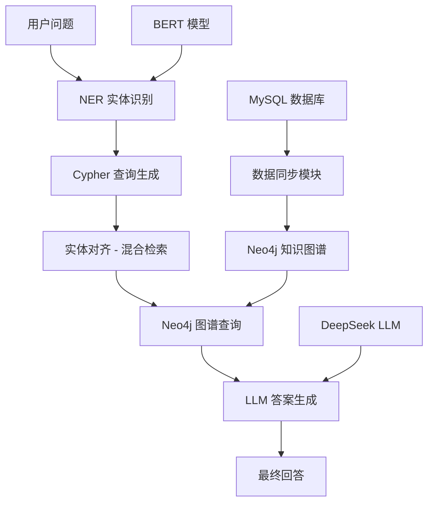

# EC-Graph: 基于知识图谱的电商智能客服问答系统

🛍️ 一个融合知识图谱、命名实体识别 (NER) 和大语言模型的电商领域智能问答系统

## 📖 项目简介

EC-Graph 是一个面向电商领域的智能客服问答系统，通过结合 Neo4j 知识图谱、BERT 命名实体识别模型和 DeepSeek 大语言模型，实现了对用户问题的准确理解和智能回答。

### 核心功能

- 🧠 **知识图谱构建**: 从 MySQL 数据库同步商品分类、属性、品牌等数据到 Neo4j
- 🔍 **命名实体识别**: 基于 BERT 的 NER 模型，识别电商标签中的关键实体
- 💬 **智能问答**: 结合图谱查询和 LLM 推理，提供准确的自然语言回答
- 🎯 **混合检索**: 支持向量检索 + 关键词检索的实体对齐
- 🌐 **Web 界面**: 基于 FastAPI 的交互式聊天界面

## 🏗️ 系统架构



## 📁 项目结构

```
ec_graph/
├── src/
│   ├── configuration/      # 配置文件
│   │   └── config.py       # 路径、超参数、数据库连接等配置
│   ├── datasync/           # 数据同步模块
│   │   ├── utils.py        # MySQL 读取器和 Neo4j 写入器
│   │   ├── table_sync.py   # 表数据同步逻辑
│   │   └── text_sync.py    # 文本数据同步
│   ├── ner/                # 命名实体识别模块
│   │   ├── preprocess.py   # 数据预处理和标注
│   │   ├── train.py        # BERT 模型训练
│   │   ├── predict.py      # 模型预测和实体抽取
│   │   └── eval.py         # 模型评估
│   ├── web/                # Web 服务模块
│   │   ├── app.py          # FastAPI 应用主入口
│   │   ├── service.py      # 聊天服务核心逻辑
│   │   ├── schemas.py      # 数据模式定义
│   │   └── utils.py        # 工具函数
│   └── test_langchain_graph.ipynb  # 测试 Notebook
├── data/ner/
│   ├── raw/                # 原始标注数据
│   └── processed/          # 处理后的数据集
├── checkpoints/ner/        # 训练好的模型检查点
├── logs/ner/               # TensorBoard 训练日志
├── main.py                 # 主程序入口
└── .env.py                 # 环境变量配置
```

## 🔧 技术栈

### 后端框架
- **Python 3.10+**
- **FastAPI**: Web 框架
- **PyTorch**: 深度学习框架

### 核心库
- **Transformers**: BERT 模型训练和推理
- **LangChain**: LLM 应用开发框架
- **Neo4j GraphRAG**: 知识图谱检索
- **Datasets**: 数据集加载和处理

### 数据库
- **MySQL**: 关系型数据存储
- **Neo4j**: 图数据库

### 模型
- **google-bert/bert-base-chinese**: 中文 NER 基础模型
- **BAAI/bge-base-zh-v1.5**: 中文嵌入模型
- **DeepSeek Chat**: 大语言模型

## 🚀 快速开始

### 环境要求

- Python 3.10 或更高版本
- CUDA 11.7+ (推荐 GPU 训练)
- MySQL 5.7+
- Neo4j 4.4+

### 安装依赖

```bash
pip install torch transformers datasets evaluate seqeval
pip install fastapi uvicorn starlette
pip install langchain-core langchain-huggingface langchain-deepseek langchain-neo4j
pip install neo4j-graphrag neo4j pymysql
pip install python-dotenv
```

### 配置步骤

1. **修改配置文件** `src/configuration/config.py`:
   ```python
   # MySQL 配置
   MYSQL_CONFIG = {
       'host': 'localhost',
       'port': 3306,
       'user': 'root',
       'password': 'your_password',
       'database': 'gmall',
   }
   
   # Neo4j 配置
   NEO4J_CONFIG = {
       'uri': "neo4j://localhost:7687",
       'auth': ("neo4j", "your_password")
   }
   
   # API Key
   API_KEY = 'your_deepseek_api_key'
   ```

2. **配置环境变量** `.env.py`:
   ```python
   HF_ENDPOINT = "https://hf-mirror.com"  # 国内镜像加速
   ```

### 使用流程

#### 1. 数据同步 (构建知识图谱)

```bash
cd src/datasync
python table_sync.py
```

这将执行以下操作：
- 同步三级分类数据 (Category1/2/3)
- 同步平台属性和值
- 同步商品 SPU/SKU 信息
- 同步品牌信息
- 同步销售属性

#### 2. NER 模型训练

```bash
# 数据预处理
cd src/ner
python preprocess.py

# 训练模型
python train.py
```

训练完成后，最佳模型将保存在 `checkpoints/ner/best_model/`

#### 3. 启动 Web 服务

```bash
cd src/web
python app.py
```

服务将在 `http://localhost:8000` 启动

#### 4. 访问界面

打开浏览器访问 `http://localhost:8000/static/index.html`

## 📊 知识图谱 Schema

### 节点类型

| 标签 | 说明 | 属性 |
|------|------|------|
| Category1 | 一级分类 | id, name |
| Category2 | 二级分类 | id, name |
| Category3 | 三级分类 | id, name |
| BaseAttrName | 平台属性名 | id, name |
| BaseAttrValue | 平台属性值 | id, name |
| SPU | 标准化产品单元 | id, name |
| SKU | 库存量单位 | id, name |
| Trademark | 品牌 | id, name |
| SaleAttrName | 销售属性名 | id, name |
| SaleAttrValue | 销售属性值 | id, name |

### 关系类型

| 关系 | 起始节点 → 目标节点 | 说明 |
|------|-------------------|------|
| Belong | Category2 → Category1 | 属于 |
| Belong | Category3 → Category2 | 属于 |
| Have | Category → BaseAttrName | 拥有属性 |
| Belong | SKU → SPU | 属于 |
| Belong | SPU → Category3 | 属于 |
| Belong | SPU → Trademark | 品牌归属 |
| Have | SPU → SaleAttrName | 拥有销售属性 |
| Have | SKU → SaleAttrValue | 拥有销售属性值 |
| Have | SKU → BaseAttrValue | 拥有平台属性值 |

## 💡 使用示例

### NER 实体抽取

```python
from ner.predict import Predictor
from transformers import AutoTokenizer, AutoModelForTokenClassification
from configuration.config import *

device = torch.device('cuda' if torch.cuda.is_available() else 'cpu')
model = AutoModelForTokenClassification.from_pretrained(
    str(CHECKPOINT_DIR / NER_DIR / 'best_model')
)
tokenizer = AutoTokenizer.from_pretrained(
    str(CHECKPOINT_DIR / NER_DIR / 'best_model')
)

predictor = Predictor(model, tokenizer, device)

text = "麦德龙德国进口双心多维叶黄素护眼营养软胶囊 30 粒 x3 盒眼干涩"
entities = predictor.extract(text)
print(entities)  # ['德国进口', '护眼', '营养软胶囊']
```

### 智能问答

```python
from web.service import ChatService

chat_service = ChatService()

# 示例问题
questions = [
    "华为都有哪些手机产品？",
    "价格低于 1000 元的连衣裙有哪些？",
    "小米品牌的电视销量怎么样？"
]

for question in questions:
    answer = chat_service.chat(question)
    print(f"Q: {question}")
    print(f"A: {answer}\n")
```

## 🔬 核心技术详解

### 1. 实体识别 (NER)

采用 BERT + BIO 标注体系：
- **B**: 实体开始 (Begin)
- **I**: 实体内部 (Inside)
- **O**: 非实体 (Outside)

训练参数：
- Batch Size: 2
- Epochs: 5
- Learning Rate: 5e-5
- 早停策略：patience=50

### 2. 实体对齐 (混合检索)

结合向量检索和关键词检索：
```python
# 向量索引 + 全文索引 = 混合检索
Neo4jVector.from_existing_index(
    embedding_model,
    search_type=SearchType.HYBRID,
    keyword_index_name='trademark_fulltext_index'
)
```

### 3. Cypher 查询生成

使用 LLM 将自然语言转换为参数化 Cypher：
```cypher
MATCH (t:Trademark {name: $param_0})-[:Belong]-(p:SPU)
RETURN p.name
```

## 📈 性能指标

NER 模型评估指标 (在测试集上)：
- Precision: ~92%
- Recall: ~90%
- F1 Score: ~91%

## 🛠️ 常见问题

### Q: 如何添加新的实体类型？

A: 
1. 在 `config.py` 的 `LABELS` 中添加新标签
2. 重新标注数据并运行 `preprocess.py`
3. 重新训练模型 `train.py`

### Q: 如何扩展知识图谱 Schema？

A:
1. 在 MySQL 中创建对应表结构
2. 在 `table_sync.py` 中添加同步方法
3. 在 `service.py` 的 `neo4j_vectors` 中添加新的检索索引

### Q: 如何提高问答准确率？

A:
1. 增加 NER 训练数据量
2. 调整实体对齐的 k 值
3. 优化 Prompt 模板
4. 使用更强大的 LLM 模型

## 📝 许可证

本项目仅供学习和研究使用

## 🤝 贡献指南

欢迎提交 Issue 和 Pull Request！

## 📧 联系方式

如有问题请提交 Issue 或联系开发者

---

**Made with ❤️ for E-commerce AI**
